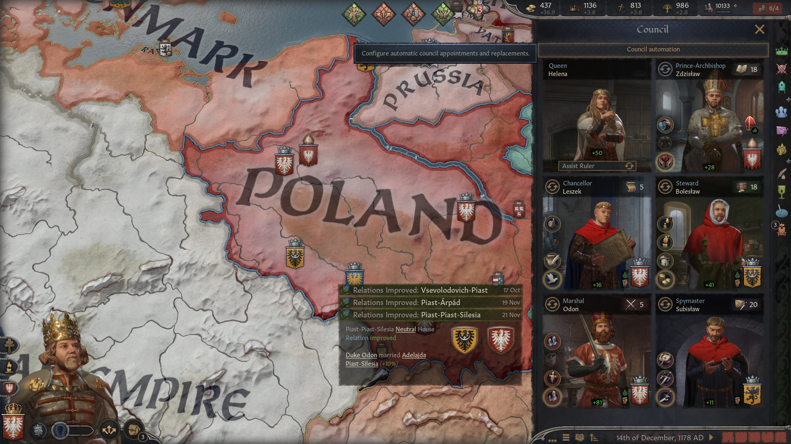
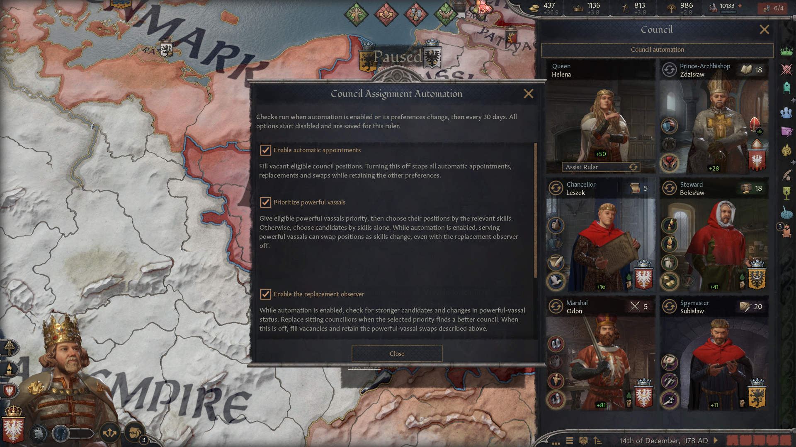

# council assignment automation

## At a glance

- 🟢 **Version 0.1.0** · Targets CK3 **1.20.0.4**.
- 🟢 **Standalone:** no other mod required.
- 🟢 Fill council vacancies and keep a capable council with three settings.
- 🟢 **Languages:** English, French, German, Japanese, Korean, Polish, Russian, Simplified Chinese and Spanish.
- 🔴 Replaces the council window; other mods replacing that window need a compatibility patch.
- 🔴 Uses available candidates and changeable positions. Special councils and protected appointments are excluded.

## Put the right people around the table

A new councillor arrives, a powerful vassal rises, or an old adviser develops new talents. Let your council adapt without comparing every candidate by hand.

## Three settings for your council

- **Automatic appointments:** fill available council vacancies immediately when enabled, then review the council every 30 game days. Turn it off to stop further work.
- **Prioritize powerful vassals:** give eligible powerful vassals priority over other candidates, then choose their positions by the best combined relevant skills. With this option off, skills determine the best overall assignment. At equal scores, existing assignments are preferred.
- **Replace occupied positions:** watch for better candidates or changes in powerful-vassal status and replace eligible incumbents when the council can improve. With this option off, occupied positions are retained, while powerful councillors may still exchange positions when powerful-vassal priority is enabled.

The mod considers the council as a whole, so one excellent candidate cannot occupy two positions. Changing an active setting triggers another review. Automation runs with the council and settings windows open or closed. All three options start disabled.

## Getting started

1. Enable the mod in your launcher playset and load a campaign.
2. Open the council panel and press the new automation button beneath its heading.
3. Enable automatic appointments and choose whether powerful vassals take priority and occupied positions may be replaced.

## Compatibility and load order

No other mod is required. The mod adds its own scripts and settings window and replaces `gui/window_council.gui` to add the button. A mod replacing the same file needs a merged compatibility patch; changing load order alone cannot preserve both sets of changes.

Ordinary council roles use their relevant skill. Nomadic councils, adventurer councils and ministry systems are excluded, as is the spouse position. A vacant court chaplain position is considered where the ruler has appointment rights; a protected incumbent is retained. Vanilla eligibility and protected appointments remain relevant.

## Saves and known limits

Options are stored in the save and carry over when your player character changes. All options start off on first use. Turn automation off before removing the mod; completed appointments remain in the campaign. Keep a backup when changing a campaign's mod list.

Reviews happen every 30 game days rather than continuously each frame. An occupied position can remain unchanged because of appointment restrictions. Replacing a councillor applies the game's ordinary dismissal effects; exchanging the positions of retained councillors does not count as dismissing them from the council. Candidate scoring uses skills and the optional powerful-vassal priority; opinion and personal loyalty are not scoring criteria. Multiplayer and total conversions have no compatibility guarantee.

## Feedback and support

Include your CK3 version, government and faith, mod list, the three selected settings and the council change you expected.

- [Report an issue on GitHub](https://github.com/G4VV4KH/council_assignment_automation/issues)
- **Email:** g4vv4kh@gmail.com

### [Want to support my work? Donate on Ko-fi 💛](https://ko-fi.com/g4vv4kh)

## Find this mod elsewhere

- [Steam Workshop](https://steamcommunity.com/sharedfiles/filedetails/?id=3815689627)
- [GitHub](https://github.com/G4VV4KH/council_assignment_automation)

Paradox Mods and Nexus Mods publication pages are pending.

## My other mods

- [Parley: The Negotiating Table](https://steamcommunity.com/sharedfiles/filedetails/?id=3811090081) — negotiate diplomatic agreements.
- [Marriage Calculation Assistant](https://steamcommunity.com/sharedfiles/filedetails/?id=3811100163) — compare and sort marriage candidates.
- [Your Own Hegemony](https://steamcommunity.com/sharedfiles/filedetails/?id=3811201582) — found a custom hegemony.
- [Vassalization Extended](https://steamcommunity.com/sharedfiles/filedetails/?id=3813943691) — choose Forced Vassalization terms without a county limit.
- [Court Automation](https://steamcommunity.com/sharedfiles/filedetails/?id=3814028714) — automate court positions and recruit courtiers or knights.
- [Nomad Autorefill](https://steamcommunity.com/sharedfiles/filedetails/?id=3814793283) — automatically reinforce nomadic Men-at-Arms using herd or gold.
- [Tax Collection Automation](https://steamcommunity.com/sharedfiles/filedetails/?id=3815381275) — automatically assign tax collectors and optimize tax jurisdictions.

These mods are optional.

## Credits

Cover artwork was generated with AI. The author supplied the council icon reference. Code, translations and publication text were developed with AI assistance.

## Screenshots

Open the automation menu directly from the council panel.

Choose automatic appointments, powerful-vassal priority and replacement monitoring independently.

## Contributing

See [developer notes](dev.md) for implementation, validation and contribution guidance.
